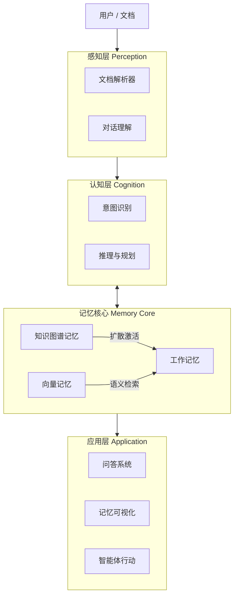

<div align="center">


# 🧠 DocThinker
### 具有类人脑记忆架构的智能个人知识助手
*超越传统检索，像人类一样思考与记忆*

[](LICENSE)
[](https://www.python.org/downloads/)
[]()

[核心特性](#-核心特性) • [架构设计](#-架构设计) • [快速开始](#-快速开始) • [项目结构](#-项目结构)

</div>

---

## 📖 项目简介

**DocThinker** 是下一代智能体系统，旨在突破传统 RAG（检索增强生成）的局限。它不再仅仅是搜索相似的文本片段，而是构建了一个**结构化、类人脑的记忆系统**。

在这个系统中，知识被存储为相互连接的情节（Episodes）、概念（Concepts）和实体（Entities）。它能够像人类大脑一样，理解复杂的文档，建立知识图谱，并主动联想相关信息。

---

## ✨ 核心特性

### 1. 🧠 基于 KG 的记忆架构
DocThinker 将知识图谱（KG）视为记忆本身，而非仅仅是外挂数据库。
- **情节节点 (Episode Nodes)**：每一次交互（文档阅读、对话、事件）都作为图中的一个节点。
- **实体与概念 (Entity & Concept)**：自动提取并链接到相关情节。
- **统一存储**：结构化关系与向量嵌入（Embedding）融合在同一个图谱中。

### 2. 🔗 自动联想机制 (Auto-Association)
系统不仅被动等待查询，更具备主动思考能力。
- **写入时联想 (On-Insert Association)**：新知识写入时，自动发现并连接到已有的相关记忆。
- **扩散激活 (Spreading Activation)**：检索过程模拟人类思维，通过激活概念节点并向四周扩散，寻找潜在关联。
- **自发回忆 (Spontaneous Recall)**：根据上下文主动浮现相关记忆，无需显式搜索。

### 3. 📄 多模态感知 (Multimodal Perception)
基于 **MinerU** 和 **Docling** 强大的解析能力，DocThinker 能够深度理解文档。
- **深度解析**：精准识别 PDF 布局、表格、公式和图片。
- **层级结构保持**：完整保留文档的逻辑结构（章 -> 节 -> 段落），不仅仅是切片。

---

## 🏗 架构设计

系统模仿人类认知过程：**感知 (Perception) → 认知 (Cognition) → 记忆 (Memory) → 应用 (Application)**。



---

## 🚀 快速开始

### 环境要求
- Python 3.10+
- Git

### 安装步骤

```bash
# 1. 克隆仓库
git clone https://github.com/Yang-Jiashu/doc-thinker.git
cd doc-thinker

# 2. 创建并激活虚拟环境
python -m venv .venv
# Windows:
.venv\Scripts\activate
# Linux/macOS:
# source .venv/bin/activate

# 3. 安装依赖
pip install -U pip
pip install -r requirements.txt
pip install -e .
```

### 配置
复制示例配置文件并填入你的 API Key（支持 OpenAI, DashScope, SiliconFlow 等）：

```bash
cp env.example .env
# 编辑 .env 文件填入 API Key
```

### 运行

**启动交互式对话：**
```bash
python main.py
```

**启动 API 服务：**
```bash
python main.py --server
```

---

## 📂 项目结构

| 目录 | 说明 |
|------|------|
| `docthinker/` | **DocThinker 主库**：解析、入库、查询、知识图谱、超图、认知、UI、FastAPI 后端（`docthinker.server.app`）。 |
| `graphcore/` | **图 RAG 引擎**：KG 与向量检索、LLM 绑定等，被 docthinker 调用。 |
| `neuro_core/` | **类脑记忆（NeuroAgent）**：KG 构建、扩散激活、自动联想，供 `main.py` 交互/API 使用。 |
| `neuro_memory/` | **类脑记忆（DocThinker 集成）**：与 docthinker 服务端集成的记忆引擎。 |
| `perception/` | **感知层**：文档解析（PDF/MD）与对话输入。 |
| `cognition/` | **认知层**：意图理解与任务规划。 |
| `agent/` | **智能体编排**：Agent 逻辑与会话管理。 |
| `retrieval/` | **检索层**：混合检索（图 + 向量）。 |
| `api/` | **NeuroAgent 的 FastAPI**：`main.py --server` 时使用。 |

**启动说明**：Web UI 使用 **DocThinker 后端** 时，请先启动 `python -m uvicorn docthinker.server.app:app --host 0.0.0.0 --port 8000`，再在另一终端运行 `python run_ui.py`；仅需 **NeuroAgent** 时使用 `python main.py` / `python main.py --server`。

---

## 🤝 贡献指南

欢迎提交 Pull Request 或 Issue！详见 [CONTRIBUTING.md](CONTRIBUTING.md)。

## 📄 开源协议

本项目采用 [MIT 协议](LICENSE) 开源。
